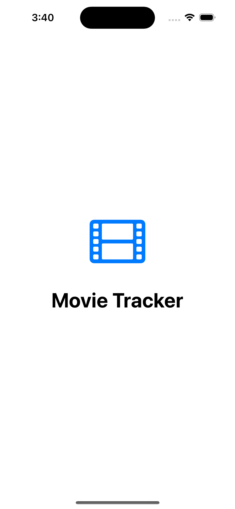
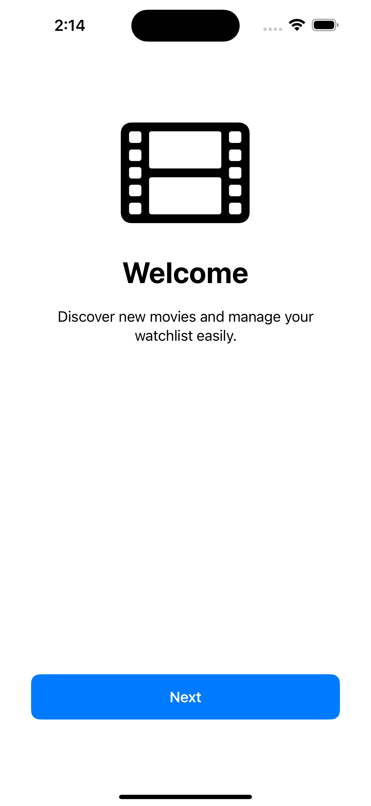
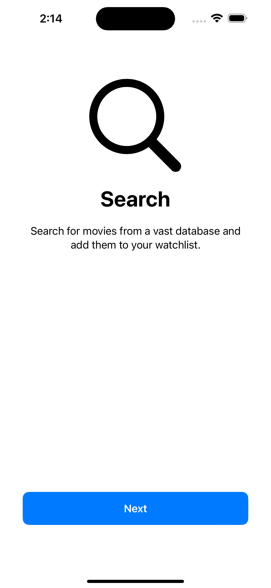
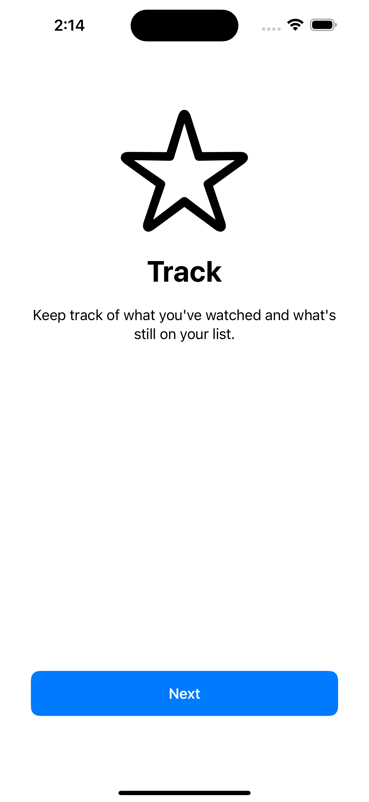
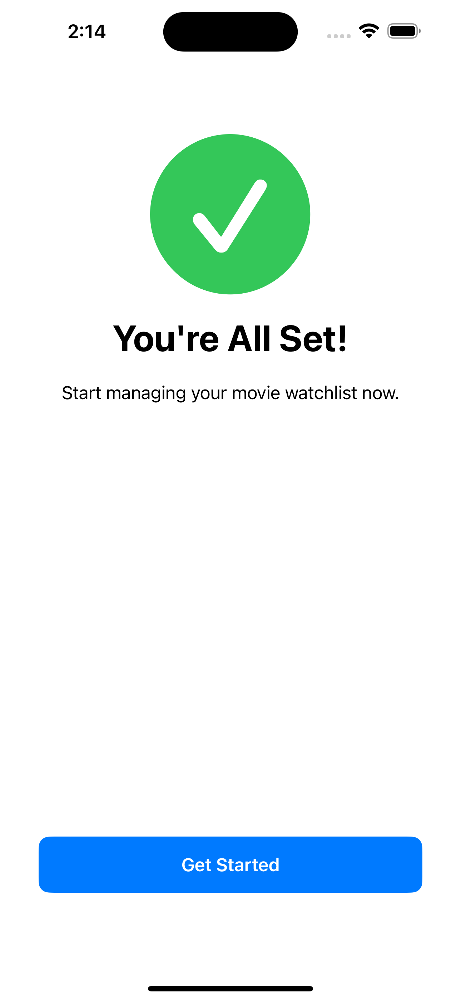
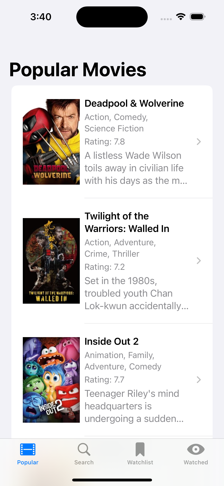
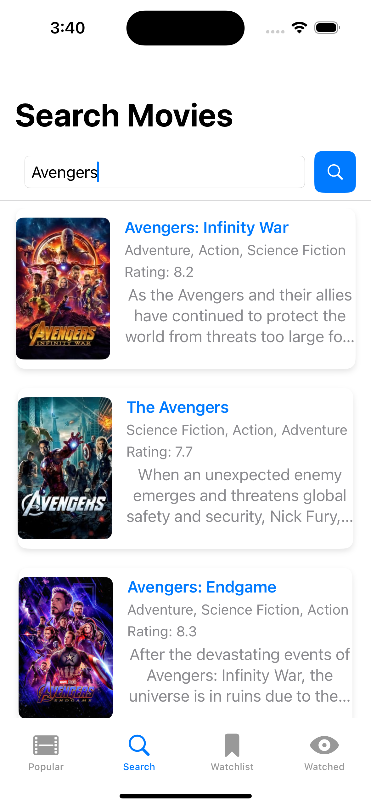
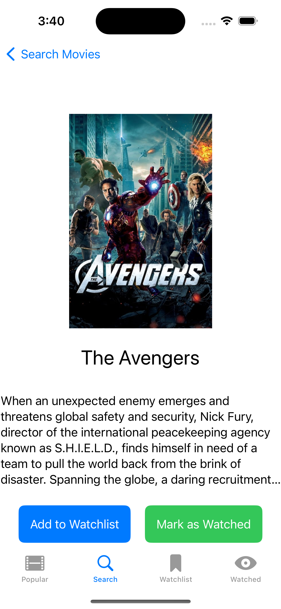
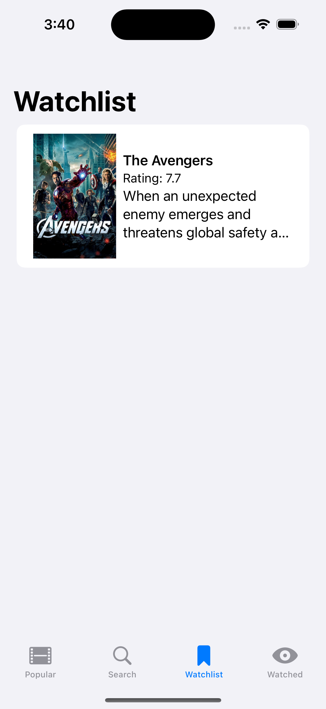
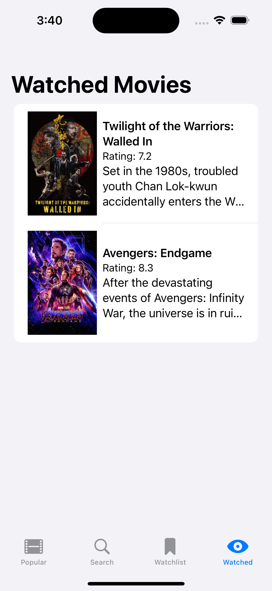

**Movie Tracker App**

*Project Idea:*

The Movie Tracker app is designed to help users discover, track, and manage movies they’ve watched or plan to watch. The app fetches real-time movie data using The Movie Database (TMDB) API and enables users to create a watchlist and track watched movies. The concept aligns closely with the skills learned in the curriculum, including SwiftUI, data persistence, networking using modern Swift concurrency (async/await), and the MVVM architecture.

*Skills Used:*

  

 - SwiftUI for building the user interface.
 - NavigationStack and TabView for navigation.
 - Userdefaults for data persistence on the device.
 - Modern concurrency with async/await for fetching data from the network.
 - MVVM (Model-View-ViewModel) architecture for maintaining separation of concerns.
 - Error handling for all network-related tasks.

*How to build and run the App:*

 1. Create an Account on [TMDB website.](https://www.themoviedb.org)
 2. Apply for an API key under the API section.
 3. Once approved, you’ll receive a key that can be used to make API requests to TMDB.
 4. Navigate to the Assets folder in Xcode and open the tmdbapi.plist file.
 5. Replace “Insert_your_API_here” with your actual API key, build and run app.

App functionality

 - Splash Screen: The app begins with a sleek splash screen that features an animation of a film reel, welcoming the user to the movie tracking experience.
   

   
   

 - Onboarding Screen: Users are taken through an onboarding flow on first launch, explaining how to use the app. On subsequent launches, the app skips this screen using UserDefaults to remember that onboarding has been completed.
   

   
   
   
   
   

 - Popular Movies Tab: A list of popular movies fetched from the TMDB API is displayed on the main tab. Users can browse through the list, and select a movie to view more details.
   

   
   

 - Search Movies: Users can search for movies using the TMDB API. Results are displayed in a list format. Missing data like genres or overviews are gracefully handled with placeholders to ensure a consistent user experience.
   

   
   

 - Movie Details View: When a user selects a movie, they are taken to a detailed view showing the movie’s description and poster. Users can add movies to their watchlist or mark them as watched.
   

   
   

 - Watchlist Tab: Movies added to the user’s watchlist are stored using userdefaults and can be accessed from this tab. Users can remove a movie from the watchlist or mark it as watched, which moves it to the Watched Tab.
   

   
   

 - Watched Tab: All movies that have been marked as watched are displayed in this tab.
   

   
   

